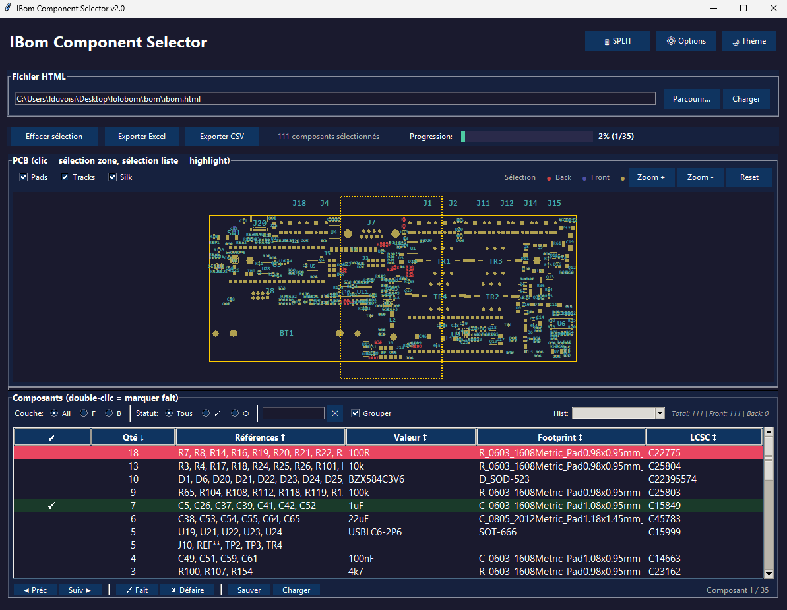

# IBom Component Selector

A Python GUI tool to visually select components from InteractiveHtmlBom files and export them to Excel or CSV.



## Features

- **Load InteractiveHtmlBom HTML files** - Supports compressed (LZ-String) and uncompressed formats
- **Visual PCB preview** - See your PCB layout with pads, silkscreen, and board outline
- **Rectangle selection** - Click on the PCB preview to open the selection window, then draw a rectangle to select components
- **Layer filtering** - Filter selected components by Front (F) or Back (B) layer
- **Search functionality** - Search components by reference, value, footprint, or LCSC code
- **Sortable columns** - Click on column headers to sort by Quantity, Value, Footprint, LCSC, etc.
- **Progress tracking** - Mark components as "processed" with a checkbox to track your work
- **Selection history** - Save and reload previous selections with their processed status
- **Statistics display** - View component counts by layer and filter status
- **LCSC part numbers** - Automatically loads LCSC codes from a CSV file if available
- **Grouped export** - Components are grouped by value/footprint with quantity count
- **Excel export** - Export selected components to a formatted Excel file
- **CSV export** - Export selected components to a CSV file
- **Keyboard shortcuts** - Quick access to common functions

## Requirements

- Python 3.x
- Required packages:
  - `openpyxl` - For Excel file generation
  - `lzstring` - For decompressing InteractiveHtmlBom data

Install dependencies:
```bash
pip install -r requirements.txt
```

Or manually:
```bash
pip install openpyxl lzstring
```

## Usage

### Quick Start

1. Double-click `launch_ibom_selector.bat` to start the application
2. The program automatically loads `bom/ibom.html` if it exists
3. Click on the PCB preview to open the selection window
4. Draw a rectangle around the components you want to select
5. Review the selected components in the list
6. Click "Export to Excel" to save

### Manual Launch

```bash
python ibom_selector.py
```

## File Structure

```
lolobom/
├── ibom_selector.py      # Main application
├── launch_ibom_selector.bat  # Windows launcher
├── README.md             # This file
├── bom/
│   └── ibom.html         # InteractiveHtmlBom file (auto-loaded)
└── lcsc/
    └── BOM-lcsc.csv      # LCSC part numbers (optional)
```

## LCSC CSV Format

To add LCSC part numbers, create a file `lcsc/BOM-lcsc.csv` with the following format:

```csv
Comment,Designator,Footprint,LCSC
100nF,"C1,C2,C3",C_0603_1608Metric,C14663
10k,"R1,R2",R_0603_1608Metric,C25804
```

The program will automatically match component references to LCSC codes.

### CSV Requirements

| Requirement | PC Version | Mobile App |
|-------------|------------|------------|
| **Encoding** | UTF-8, UTF-16, Latin-1 | **UTF-8 only** |
| **Delimiter** | Comma, Tab, Semicolon | Comma, Tab, Semicolon |
| **Columns** | `Designator` + `LCSC` | `Designator` + `LCSC` |

> ⚠️ **Excel exports** are often in UTF-16 format. For the mobile app, save as "CSV UTF-8" or convert the file encoding.

## PCB Viewer Controls

- **Left click + drag** - Draw selection rectangle
- **Mouse wheel** - Zoom in/out
- **Zoom +/-** buttons - Zoom controls
- **Reset** button - Reset view to fit

## Keyboard Shortcuts

| Shortcut | Action |
|----------|--------|
| `Ctrl+O` | Open file browser |
| `Ctrl+L` | Load current file |
| `Ctrl+S` | Export to Excel |
| `Ctrl+Shift+S` | Export to CSV |
| `Ctrl+F` | Focus search field |
| `Escape` | Clear selection |
| `F5` | Refresh PCB preview |
| `Double-click` | Toggle processed status on a row |
| `Space` | Toggle processed status on selected row |

## Component List Features

### Sorting

Click on any column header to sort the list:
- **✓** - Sort by processed status (processed items first/last)
- **Qté** - Sort by quantity
- **Références** - Sort by reference names
- **Valeur** - Sort by component value
- **Footprint** - Sort by footprint name
- **LCSC** - Sort by LCSC code

Click again to reverse the sort order. The arrow (↑/↓) indicates the current sort direction.

### Processed Tracking

Track your progress while working through the BOM:
- **Double-click** or press **Space** on a row to mark it as processed
- Processed rows are highlighted in green with a ✓
- Use the buttons at the bottom:
  - "Marquer sélection comme traitée" - Mark selected rows as processed
  - "Démarquer sélection" - Unmark selected rows
  - "Tout démarquer" - Clear all processed marks
- The counter "Traités: X/Y" shows your progress

### Selection History

Save and manage your selection zones with their processed status:
- **Automatic persistence** - History is saved in a `.ibom_history.json` file next to the HTML file
- **Sauvegarder** - Save current selection with a custom name
- **Charger** - Reload a previous selection with all processed marks restored
- **Mettre à jour** - Update an existing history entry with current changes
- **Supprimer** - Remove a selection from history

Each history entry stores:
- Selection zone coordinates
- All component data (ref, value, footprint, LCSC)
- Processed status for each component group
- Creation/modification date

## Export Format

The Excel export includes:
- **Quantity** - Number of components with same value/footprint
- **References** - List of component designators (e.g., "C1, C2, C3")
- **Value** - Component value (e.g., "100nF", "10k")
- **Footprint** - Component footprint name
- **LCSC** - LCSC part number (if available)

## Color Legend

In the PCB viewer:
- **Green** - Front layer components
- **Red** - Back layer components
- **Dark red pads** - Front SMD pads
- **Dark blue pads** - Back SMD pads
- **Gold pads** - Through-hole pads
- **White outline** - Board edge
- **Yellow dashed rectangle** - Selection area

## License

MIT License

## Credits

Designed to work with [InteractiveHtmlBom](https://github.com/openscopeproject/InteractiveHtmlBom) - a BOM plugin for KiCad.
