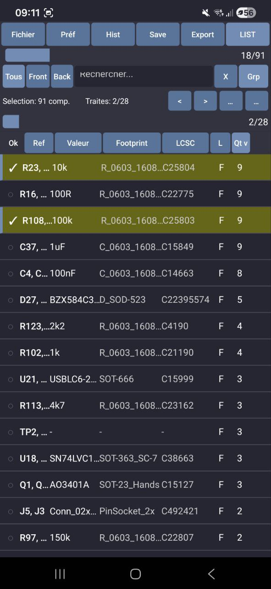

# 🔧 IBom Selector - React Native


> Mobile application for viewing and managing electronic components from InteractiveHtmlBom (IBom) files.

Complete migration of IBom Selector from **Kivy/Python** to **React Native/TypeScript** with improved performance and native interface.

---

## 📱 Screenshots

| Main View | List View | E-ink Mode |
|-----------|-----------|------------|
|  |  |  |

---

## ✨ Features

### 🔄 File Loading
- ✅ **IBom HTML Files** - Full support for InteractiveHtmlBom files
  - Automatic LZ-String decompression (Base64)
  - Direct JSON parsing for uncompressed files
  - Footprints, pads, edges and silkscreen extraction
- ✅ **LCSC CSV Files** - Import LCSC order data
  - Automatic reference matching
  - LCSC part number association

### 🖥️ Interactive PCB View
- ✅ **High-quality SVG rendering** via react-native-svg
  - Components, pads and edges display
  - Toggleable silkscreen option
  - Optional tracks (traces)
- ✅ **Advanced touch gestures** via react-native-gesture-handler
  - Smooth pinch-to-zoom
  - Pan/drag with inertia
  - Native animations with Reanimated 3
- ✅ **Rectangle selection** - Select multiple components with a gesture
- ✅ **Smart highlighting** - Highlight selected components

### 📋 Component List
- ✅ **Multi-criteria filtering**
  - By layer (Front/Back/All)
  - By status (Done/To do/All)
  - By text search (ref, value, footprint, LCSC)
- ✅ **Flexible sorting**
  - By reference, value, footprint, quantity
  - Ascending/descending order
- ✅ **Group by value** - Group identical components
- ✅ **Progress bar** - Visual progress tracking
- ✅ **Sequential navigation** - Previous/Next between components

### 💾 Selection Management
- ✅ **Checkbox on each component** - Individual marking
- ✅ **Check/uncheck all** - Batch actions
- ✅ **"Processed" state** - Mark placed components
- ✅ **Automatic persistence** - State survives restarts

### 📁 History & Backup
- ✅ **Session history** - Timestamped recording
- ✅ **Named backup** - Create save points
- ✅ **Restore** - Reload a previous session
- ✅ **Auto-save** - Configurable interval (5, 10, 15, 30 min)

### 📤 Export
- ✅ **LCSC CSV export** - Order-compatible format
- ✅ **Reference list export** - Plain text

### ⚙️ Preferences
- ✅ **E-ink mode** - Black/white theme optimized for e-paper displays (Boox)
- ✅ **Auto-detection** - Boox device recognition
- ✅ **Font size** - Adjustable (10-15px)
- ✅ **Vibration** - Haptic feedback on/off
- ✅ **Silkscreen display** - Toggle on/off
- ✅ **Group by value** - Enable/disable

---

## 🛠️ Installation

### Prerequisites

- Node.js >= 18
- npm or yarn
- Android Studio (for Android)
- Xcode (for iOS, macOS only)
- JDK 17

### Install Dependencies

```bash
# Clone the repository
git clone <repo-url>
cd ReactNative

# Install dependencies
npm install

# iOS only (macOS)
cd ios && pod install && cd ..
```

---

## 🚀 Development

### Start Metro bundler

```bash
npm start
```

### Run on Android

```bash
npm run android
```

### Run on iOS (macOS only)

```bash
npm run ios
```

### Clear cache

```bash
npm run clean
```

---

## 📦 Production APK Build

### 🐧 Linux/macOS - Automated script `build_apk.sh`

The `build_apk.sh` script **automatically handles the entire build process**, including prerequisites installation:

```bash
# Standard build
./build_apk.sh

# Build with cache cleanup
./build_apk.sh --clean

# Build with logs sent to GitHub (remote debugging)
./build_apk.sh --share-logs
```

#### What the script does:

| Step | Description |
|------|-------------|
| **[1/6] Prerequisites** | Checks and auto-installs Node.js, Java 17, Android SDK |
| **[2/6] RN Project** | Creates a clean React Native 0.73.4 project with all dependencies |
| **[3/6] Sources** | Copies TypeScript source files from `src/` |
| **[4/6] Config** | Configures Android permissions, Proguard, Babel for Reanimated |
| **[5/6] Build** | Compiles the Release APK with Gradle |
| **[6/6] Finalization** | Copies APK to `build/IBomSelector.apk` |

#### Options:

| Option | Description |
|--------|-------------|
| `--clean` | Cleans Gradle cache and recreates the project |
| `--share-logs` | Sends build logs to GitHub for remote debugging |

### 🪟 Windows - PowerShell/Batch Scripts

```powershell
# PowerShell
.\build_apk.ps1

# Batch
.\build_apk.bat
```

These scripts:
1. Install npm dependencies (if needed)
2. Clean previous builds
3. Build Release APK
4. Copy APK to `build\IBomSelector.apk`

### 📍 APK Location

```
build/IBomSelector.apk
```

### ⚠️ Windows Prerequisites

On Windows, you must have installed beforehand:
- Node.js 18+
- JDK 17 (e.g., [Adoptium Temurin](https://adoptium.net/))
- Android SDK (via Android Studio)

---

## 🏗️ Architecture

```
src/
├── core/                        # 🔧 Business logic
│   ├── types.ts                 # TypeScript interfaces
│   ├── LZString.ts              # LZ-String decompression
│   ├── IBomParser.ts            # IBom HTML parsing
│   └── CSVLoader.ts             # LCSC CSV parsing
│
├── theme/                       # 🎨 Theme system
│   ├── colors.ts                # Normal/e-ink palettes
│   ├── spacing.ts               # Spacing constants
│   └── ThemeContext.tsx         # React Context for theme
│
├── store/                       # 📦 State management (Zustand)
│   ├── useAppStore.ts           # Main app state
│   ├── usePreferencesStore.ts   # User preferences (persisted)
│   └── useHistoryStore.ts       # Session history
│
├── hooks/                       # 🪝 Custom hooks
│   ├── useEinkDetect.ts         # Auto e-ink mode detection
│   ├── useHaptic.ts             # Haptic feedback
│   ├── useFileSystem.ts         # File management
│   ├── useOrientation.ts        # Screen orientation detection
│   └── usePermissions.ts        # Android permissions
│
├── components/                  # 🧩 React Native components
│   ├── common/                  # Reusable components
│   │   ├── ThemedButton.tsx     # Themed button
│   │   ├── ThemedModal.tsx      # Themed modal
│   │   ├── ThemedToggle.tsx     # Themed toggle switch
│   │   ├── ProgressBar.tsx      # Progress bar
│   │   └── AnimatedProgress.tsx # Animated bar
│   │
│   ├── PCBView/                 # Circuit view
│   │   └── PCBView.tsx          # Interactive SVG rendering
│   │
│   ├── ComponentList/           # Component list
│   │   ├── ComponentList.tsx    # Main container
│   │   ├── ComponentRow.tsx     # Component row
│   │   ├── FilterBar.tsx        # Filter bar
│   │   └── ListHeader.tsx       # Column header
│   │
│   └── Modals/                  # Modal windows
│       ├── ComponentDetailModal.tsx  # Component details
│       ├── ExportModal.tsx           # Export options
│       ├── FilePicker.tsx            # File selection
│       ├── HistoryModal.tsx          # Session history
│       ├── PreferencesModal.tsx      # Preferences
│       └── SaveSelectionModal.tsx    # Named backup
│
└── screens/                     # 📱 Navigation screens
    ├── HomeScreen.tsx           # Main screen
    └── LoadingScreen.tsx        # Loading screen
```

---

## 📚 Main Dependencies

| Package | Version | Usage |
|---------|---------|-------|
| `react-native` | 0.73.4 | Mobile framework |
| `react-native-svg` | 14.1.0 | PCB SVG rendering |
| `react-native-gesture-handler` | 2.14.1 | Touch gestures |
| `react-native-reanimated` | 3.8.1 | Native animations |
| `zustand` | 4.5.0 | State management |
| `@react-native-async-storage/async-storage` | 1.21.0 | Local persistence |
| `react-native-document-picker` | 9.1.1 | File selection |
| `react-native-fs` | 2.20.0 | File read/write |
| `react-native-haptic-feedback` | 2.2.0 | Vibrations |
| `react-native-device-info` | 10.12.0 | Device info (e-ink detection) |
| `react-native-safe-area-context` | 4.8.2 | Safe area handling |

---

## 🔄 Migration from Kivy

| Aspect | Kivy/Python | React Native/TypeScript |
|--------|-------------|------------------------|
| **Language** | Python 3.x | TypeScript 5.3 |
| **PCB Rendering** | Kivy Canvas | react-native-svg |
| **Gestures** | Touch events | react-native-gesture-handler |
| **Animations** | Kivy Animation | react-native-reanimated |
| **State** | Properties | Zustand stores |
| **Persistence** | JSON files | AsyncStorage |
| **Theme** | Python dictionary | React Context API |
| **UI Components** | Kivy widgets | React Native components |

### Improvements over Kivy

- 🚀 **Performance** - 60fps native animations
- 📱 **Native UI** - Android/iOS native look & feel
- 🧩 **Modularity** - Reusable component architecture
- 🔒 **Type Safety** - TypeScript for fewer bugs
- 🎨 **Theming** - More flexible theme system
- 📦 **Build** - Modern toolchain (Metro, Gradle)

---

## 🎯 Usage

1. **Open an IBom file** - Tap "Open file"
2. **Optional: Load LCSC CSV** - For order info
3. **Browse components** - List or PCB view
4. **Check processed components** - Track progress
5. **Save** - Manual or automatic
6. **Export** - CSV or reference list

---

## ⚙️ Android Configuration

### Required Permissions (AndroidManifest.xml)

```xml
<uses-permission android:name="android.permission.READ_EXTERNAL_STORAGE" />
<uses-permission android:name="android.permission.WRITE_EXTERNAL_STORAGE" />
<uses-permission android:name="android.permission.VIBRATE" />
```

### Gradle Configuration

- `minSdkVersion`: 24
- `targetSdkVersion`: 34
- `compileSdkVersion`: 34

---

## 🐛 Troubleshooting

### "Unable to load script" error

```bash
npm start --reset-cache
```

### Android build error

```bash
cd android
./gradlew clean
cd ..
npm run android
```

### File permission issues

Check that the app has storage permissions in Android settings.

---

## ⚙️ E-ink Configuration

The application automatically detects Boox devices and enables e-ink mode.
The mode can also be manually enabled in preferences.

E-ink optimizations:
- Opaque white background
- Visible black borders
- No gradients or transparency
- Maximum contrast

---

## 📄 License

MIT © 2024-2026

---

## 🤝 Contributing

Contributions are welcome! Feel free to open an issue or a pull request.
